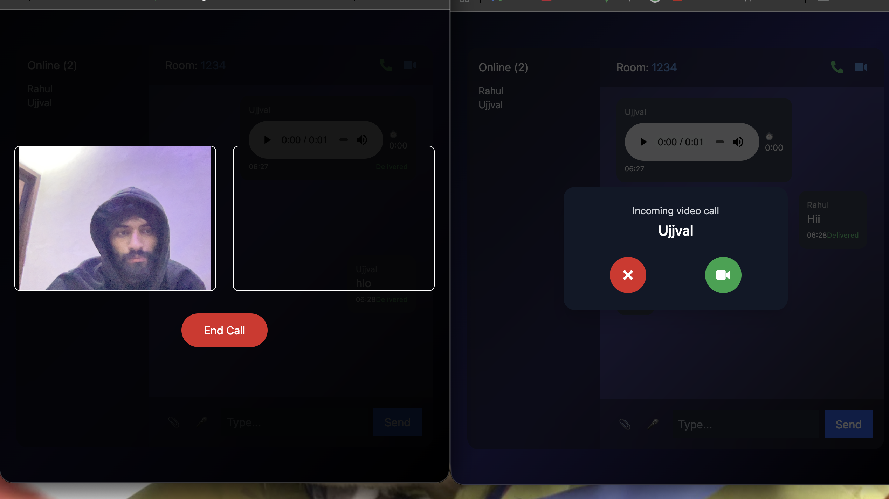

🚀 Real-SYNOX
Real-Time Chat & Video Calling Application

Real-SYNOX is a WhatsApp-inspired real-time communication platform that enables users to chat, share files, send voice messages, and make 1-to-1 video/audio calls using WebRTC.
Built with modern web technologies for low latency, scalability, and real-time performance.

🌐 Live Features

🔐 Join chat rooms using username & room ID

💬 Real-time messaging (Socket.IO)

✍️ Typing indicators

👁️ Message seen / delivered status

📎 File & image sharing

🎙️ Voice message recording

📞 Audio calling

🎥 Video calling (WebRTC)

❌ Call accept / reject / end (WhatsApp-style popup)

🟢 Online users list

🛠️ Tech Stack
Frontend

React + TypeScript

Vite

Tailwind CSS

Socket.IO Client

WebRTC (RTCPeerConnection, ICE, STUN)

MediaRecorder API

Backend

Node.js

Express

Socket.IO

WebRTC signaling (offer / answer / ICE)

Dev & Tooling

ESLint

Git & GitHub

dotenv (environment configs)

🧠 Architecture Overview
Client (React + TS)
   |
   |  WebSocket (Socket.IO)
   |
Server (Node + Express)
   |
   |  WebRTC Signaling
   |
Peer-to-Peer Video / Audio

Socket.IO handles:

Chat messages

Typing events

Call signaling

WebRTC handles:

Real video/audio streaming

Peer-to-peer media exchange  

📸 UI Preview
🔐 Login Screen

  

💬 Real-Time Chat Interface

  

📞 Video Calling (WebRTC)

  

⚙️ Environment Variables
Client (client/.env.local)
VITE_SERVER_URL=http://localhost:3001

Server (server/.env)
PORT=3001

✅ .env files are ignored via .gitignore for security.

🚀 Getting Started
1️⃣ Clone Repository
git clone https://github.com/<your-username>/Real-SYNOX.git
cd Real-SYNOX

2️⃣ Start Server
cd server
npm install
npm start

Server runs on:
http://localhost:3001

3️⃣ Start Client
cd client
npm install
npm run dev

Client runs on:
http://localhost:5173

🧪 Tested Scenarios

Multiple users in same room

Call accept / reject handling

Reconnect on refresh

Call end sync between peers

📌 Future Enhancements

Group video calls

Chat history persistence (DB)

Authentication (JWT / OAuth)

Screen sharing

Mobile responsiveness

TURN server for NAT traversal

👨‍💻 Author

Rahul Prakash

GitHub: https://github.com/Rahul-curious

LinkedIn: https://www.linkedin.com/in/rahul-prakash-774b0a289/

⭐ Support

If you found this project useful:

⭐ Star the repo

🍴 Fork it

📢 Share it

📄 License

This project is licensed under the MIT License.
